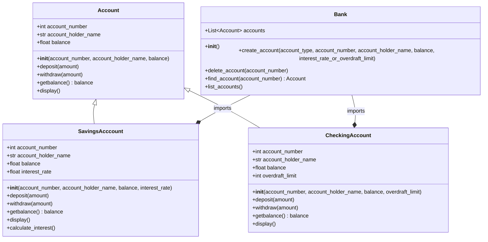

# UML Class Diagram

```mermaid
classDiagram
   class Bank {
      +List~Account~ accounts
      +__init__()
      +create_account(account_type, account_number, account_holder_name, balance, interest_rate_or_overdraft_limit)
      +delete_account(account_number)
      +find_account(account_number) Account
      +list_accounts()
  }
  class Account {
      +int account_number
      +str account_holder_name
      +float balance
      +__init__(account_number, account_holder_name, balance)
      +deposit(amount)
      +withdraw(amount)
      +getbalance() balance
      +display()
  }
  class SavingsAcccount {
      +int account_number
      +str account_holder_name
      +float balance
      +float interest_rate
      +__init__(account_number, account_holder_name, balance, interest_rate)
      +deposit(amount)
      +withdraw(amount)
      +getbalance() balance
      +display()
      +calculate_interest()
  }
  class CheckingAccount {
      +int account_number
      +str account_holder_name
      +float balance
      +int overdraft_limit
      +__init__(account_number, account_holder_name, balance, overdraft_limit)
      +deposit(amount)
      +withdraw(amount)
      +getbalance() balance
      +display()
  }
  Account <|-- SavingsAcccount
  Account <|-- CheckingAccount
  Bank --* SavingsAcccount : imports
  Bank --* CheckingAccount : imports
```