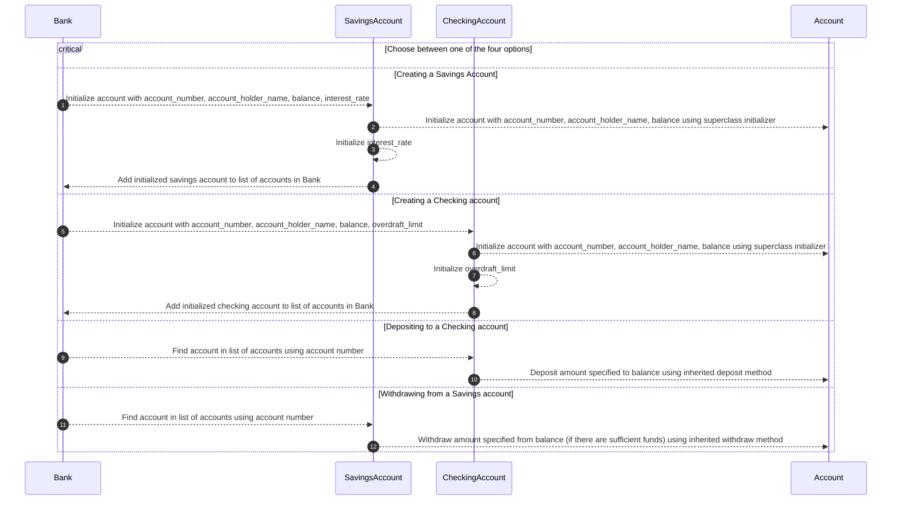

# UML Sequence Diagram

```mermaid
%% Creating a Savings Account
%% Creating a Checking account
%% Depositing to a Checking account
%% Withdrawing from a Savings account
sequenceDiagram
    participant Bank
    participant SavingsAccount
    participant CheckingAccount
    participant Account
    autonumber
    critical Choose between one of the four options
    option Creating a Savings Account   
        Bank-->>SavingsAccount: Initialize account with account_number, account_holder_name, balance, interest_rate
        SavingsAccount-->>Account: Initialize account with account_number, account_holder_name, balance using superclass initializer
        SavingsAccount-->>SavingsAccount: Initialize interest_rate
        SavingsAccount-->>Bank: Add initialized savings account to list of accounts in Bank
    option Creating a Checking account
        Bank-->>CheckingAccount: Initialize account with account_number, account_holder_name, balance, overdraft_limit
        CheckingAccount-->>Account: Initialize account with account_number, account_holder_name, balance using superclass initializer
        CheckingAccount-->>CheckingAccount: Initialize overdraft_limit
        CheckingAccount-->>Bank: Add initialized checking account to list of accounts in Bank
    option Depositing to a Checking account
        Bank-->>CheckingAccount: Find account in list of accounts using account number
        CheckingAccount-->>Account: Deposit amount specified to balance using inherited deposit method
    option Withdrawing from a Savings account
        Bank-->>SavingsAccount: Find account in list of accounts using account number
        SavingsAccount-->>Account: Withdraw amount specified from balance (if there are sufficient funds) using inherited withdraw method
    end
```